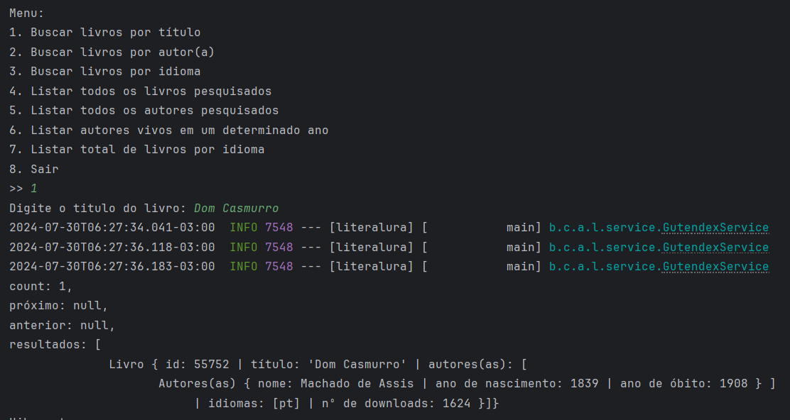

# LiterAlura

[Capa do projeto](./assets/images/literalura-banner.png)

 
 
 


## Índice
  * [Descrição do Projeto](#descrição-do-projeto)
  * [Status do Projeto](#status-do-projeto)
  * [Funcionalidades](#funcionalidades)
  * [Demonstração da Aplicação](#demonstração-da-aplicação)
    * [Rotas para teste](#rotas-para-teste)
  * [Acesso ao Projeto](#acesso-ao-projeto)
    * [Pré-requisitos](#pré-requisitos)
    * [Instalação](#instalação)
  * [Tecnologias Utilizadas](#tecnologias-utilizadas)
  * [Desenvolvido por](#desenvolvido-por)
  * [Licença](#licença)

## Descrição do Projeto

Literalura é uma plataforma para catalogar livros desenvolvida durante a trilha Back-end Java do programa One Next Education (Oracle e Alura). Utiliza Java com Spring Boot, integrando banco de dados e a API Gutendex. Seu objetivo é facilitar a busca de livros e exibir estatísticas sobre os títulos cadastrados.

LiterAlura é uma ótima oportunidade para aplicar conceitos importantes de persistência de dados, integração com APIs externas, recursos avançados do Spring Framework, além de boas práticas de desenvolvimento e documentação de software.<br>

## Status do Projeto

As funcionalidades básicas do projeto foram implementadas e melhorias poderão ser feitas futuramente.

## Funcionalidades

- **Menu inicial**
  

- **Buscar livros por título**: Permite buscar livros pelo título na API Gutendex.
  

- **Listar livros por idioma**: Lista todos os livros disponíveis no idioma escolhido.
  

- **Contar livros por idioma**: Exibe a quantidade de livros disponíveis em um idioma específico.
  

- **Listar todos os livros pesquisados**: Mostra todos os livros que foram buscados e salvos no banco de dados.
  

- **Listar todos os autores pesquisados**: Mostra todos os autores que foram buscados e salvos no banco de dados.
  

- **Listar autores vivos em um determinado ano**: Lista todos os autores que estavam vivos no ano especificado.
  
  
  <br>
  

## Demonstração da Aplicação

Para visualizar as funcionalidades, você pode clonar e testar o LiterAlura localmente, na IDE da sua preferência, ou utilizar as rotas disponibilizadas para testes com ferramentas como Insomnia ou Postman.

#### Rotas para teste

[incluir mais rotas]

* Buscar livros por título:```sh``````GET /books?search=titulo```

* Listar livros por idioma: GET /books?languages=pt
  
* Contar livros por idioma: GET /books/countByLanguage?language=pt
  

## Acesso ao Projeto

#### Pré-requisitos

* Java 17
* PostgreSQL
* Maven

#### Instalação

1. Clone o repositório:git clone https://github.com/thatimoreira/literalura.git
2. Entre no diretório do projetocd literalura
3. Configure o banco de dados PostgreSQL com as variáveis de ambiente:export SPRING_DATASOURCE_URL=jdbc:postgresql://localhost:5432/literaluraexport SPRING_DATASOURCE_USERNAME=seu-usuarioexport SPRING_DATASOURCE_PASSWORD=sua-senha
4. Rode a aplicação:./mvnw spring-boot:run

## Tecnologias Utilizadas

* Java 17
* Spring Boot 3.3.2
* PostgreSQL 16
* Hibernate
* Jackson
* Maven
* IDE: Intellij IDEA

## Desenvolvido por

Thatiana Moreira

## Licença

Este projeto está licenciado sob a Licença MIT - veja o arquivo [LICENSE](./LICENSE) para mais detalhes.
